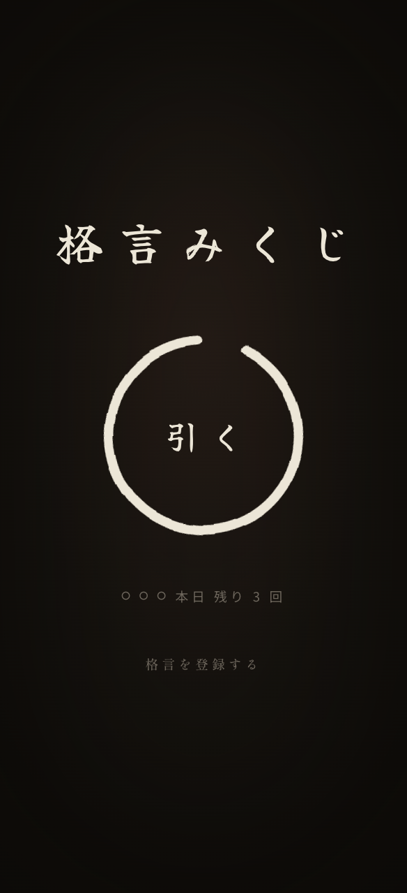
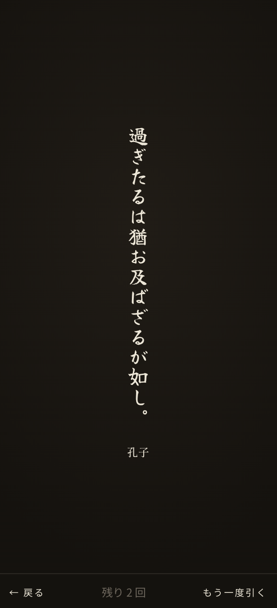

# 格言みくじ

A phone-first app for drawing random Japanese maxims.

**[→ Open the app](https://kakugen-app.sh0wtana.workers.dev/)**

<p align="center">
  
  &nbsp;&nbsp;
  
</p>

## Features

- Draw up to 3 maxims per day (resets at midnight JST)
- Vertical calligraphic result page — save it as a phone wallpaper
- No account required
- Submit your own maxim

## Development

```bash
npm install
npx wrangler d1 execute kakugen --local --file=migrations/0001_create_kakugen.sql
npx wrangler d1 execute kakugen --local --file=seed/seed.sql
npx wrangler dev
```

## Tech Stack

- [Hono](https://hono.dev/) on [Cloudflare Workers](https://workers.cloudflare.com/)
- Cloudflare D1 (SQLite)
- Server-rendered HTML — no client framework
